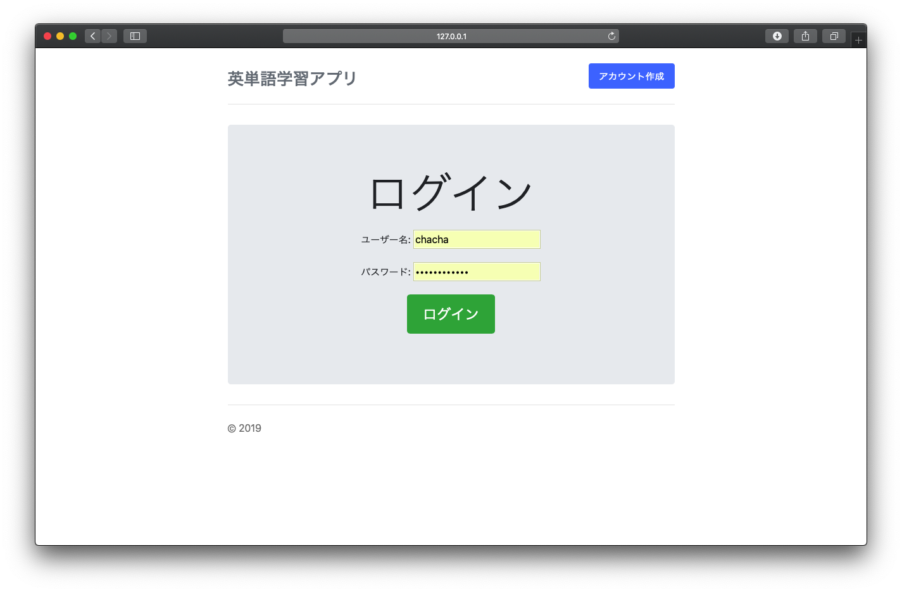
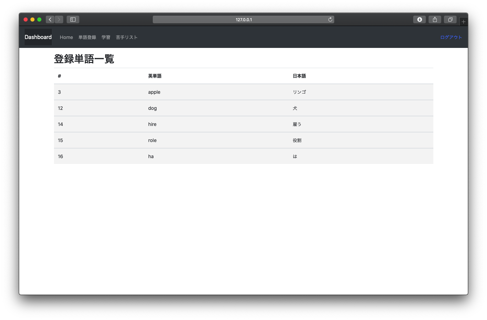
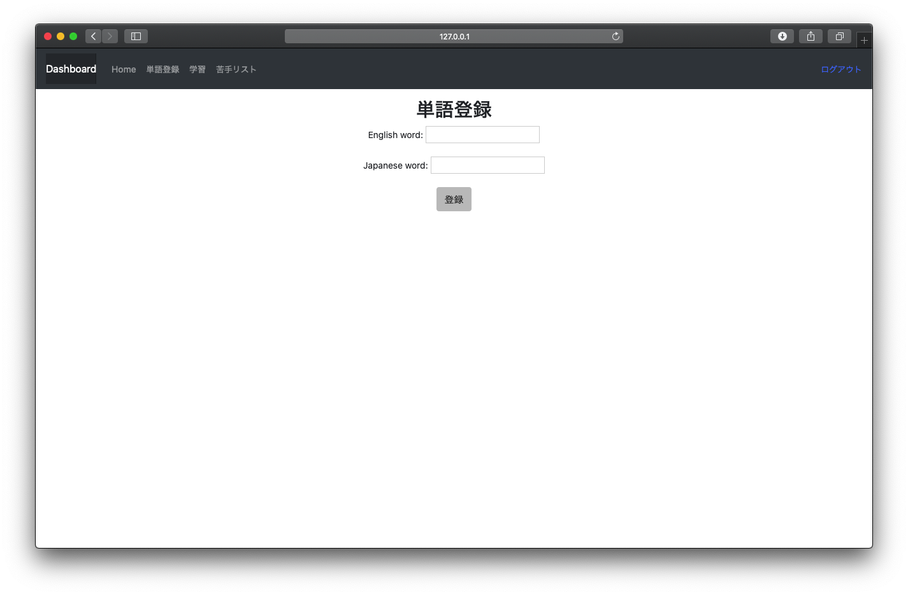
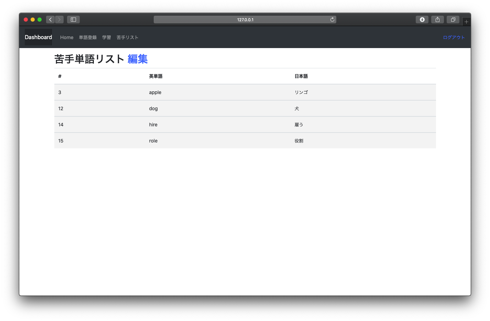
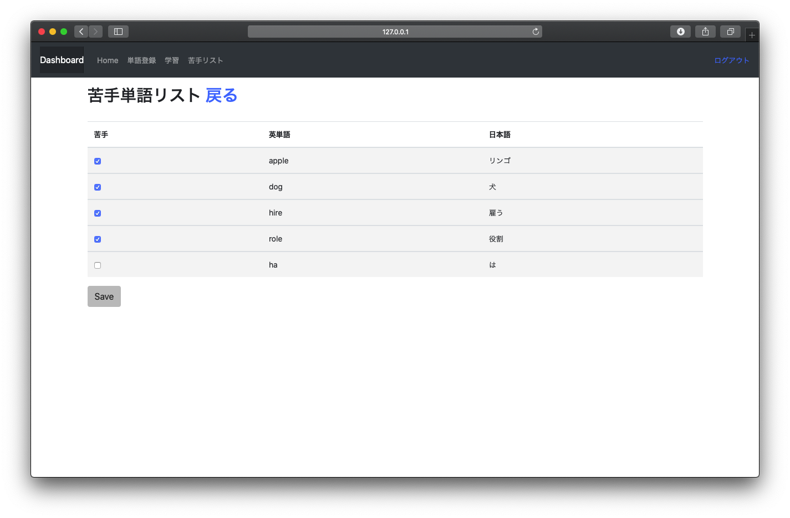
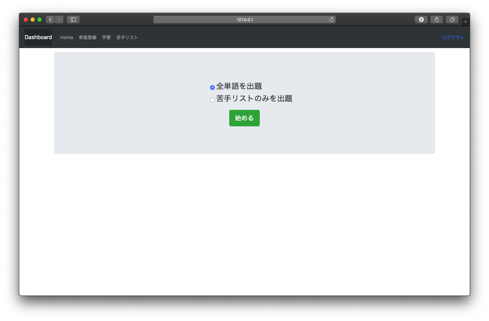
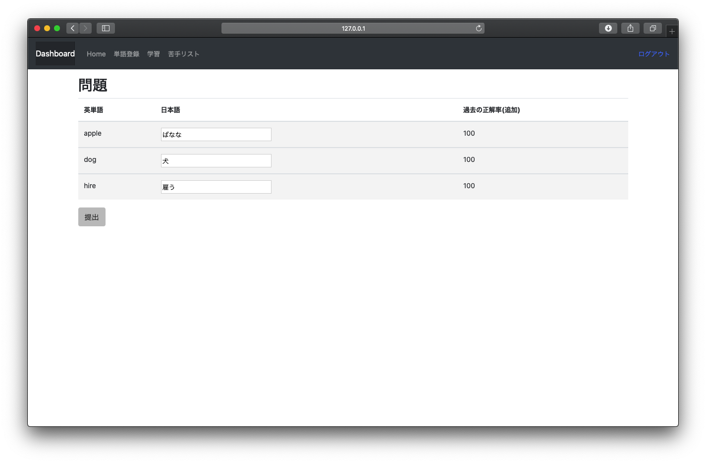
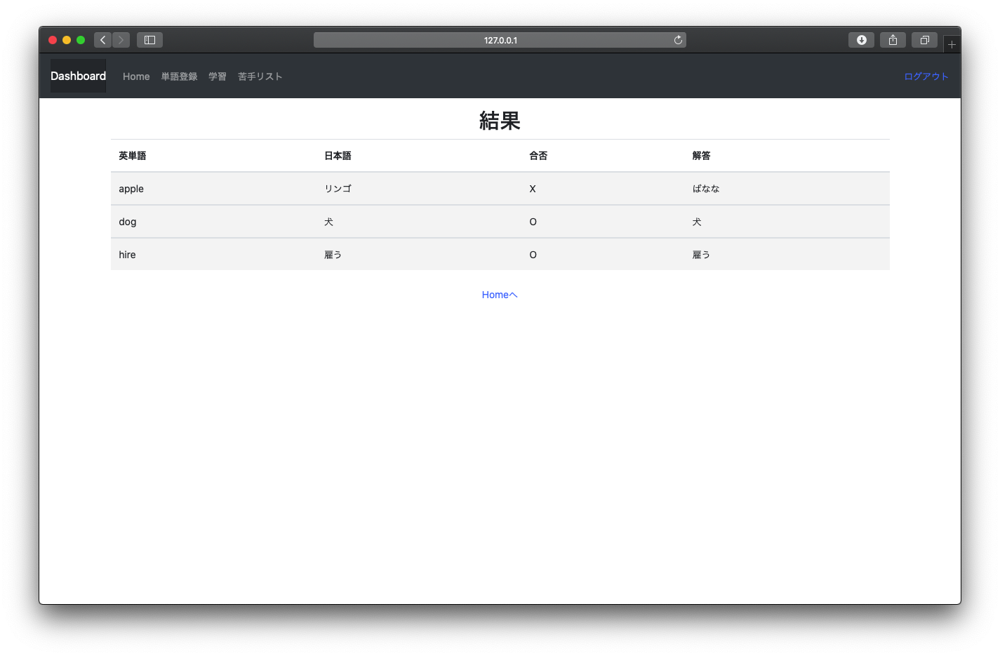

# 英単語学習Webアプリケーション(English_word_learning_web_app)

 ログイン機能付きの英単語学習アプリケーションで、自分で英単語と訳を入力し学習する。
 学習方法は、すべての単語か苦手な単語のみの２種類である。
 
 
## 実装予定の機能

* 英単語をcsvファイルから入力できるようにする
* 正解率を計算し、表示
* ユーザー毎に複数の単語帳を作成可能にする
 
## 開発環境

* python 3.7.0
* django 2.2.4
* Bootstrap

## 画像

 
